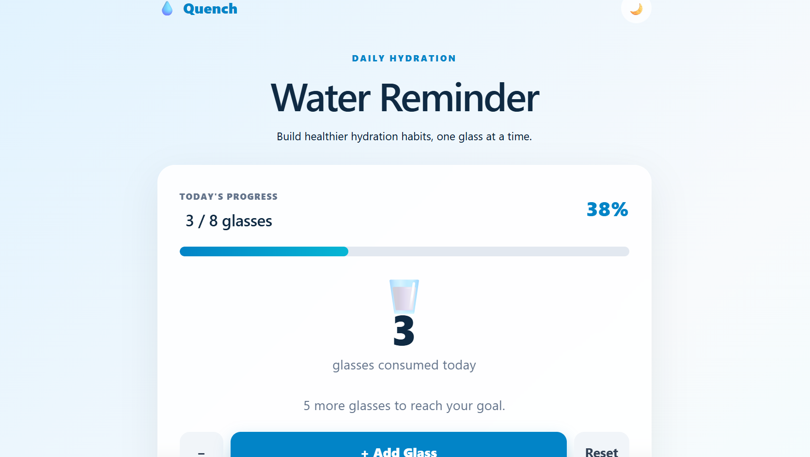
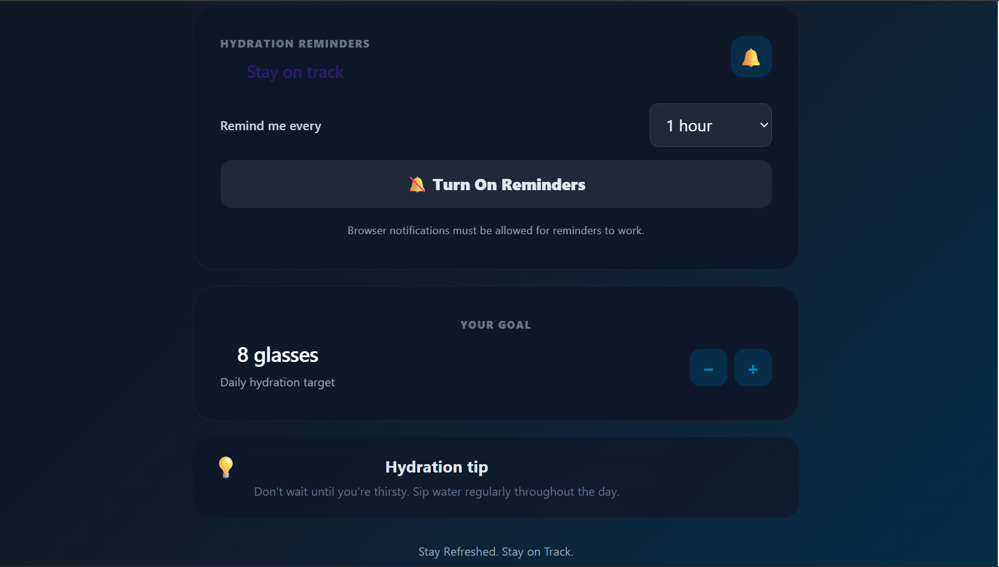
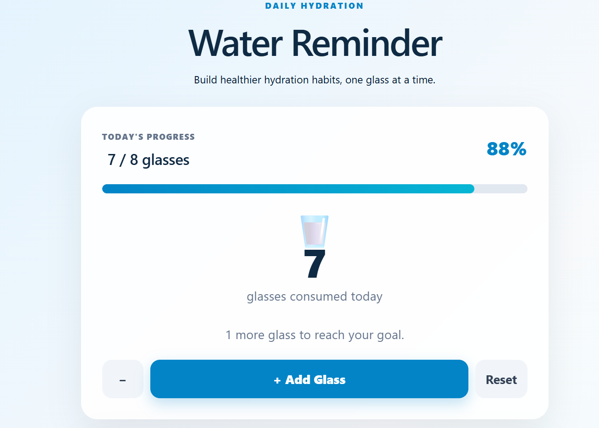

# 💧 Quench — Water Reminder

> Stay hydrated. Stay on track.

Quench is a simple and interactive water reminder web app built with **React** and **Vite**. It helps you track your daily water intake, set hydration goals, and build a consistent hydration routine.

##   Features

-  **Water Intake Tracking**: Track the amount of water you drink throughout the day.
-  **Daily Hydration Goal**: Set and update your personal daily water goal.
-  **Progress Tracking**: Visualize your progress toward your daily hydration target.
-  **Timer Reminders**: Get reminders to drink water throughout the day.
-  **Day & Night Themes**: Switch between light and dark themes for a comfortable experience.
-  **Progress Reset**: Reset your daily water intake when needed.
-  **Responsive Design**: Designed to work across different screen sizes.

##   Built With

- **React**
- **Vite**
- **JavaScript**
- **CSS**
- **Vercel** — Deployment

##   Live Demo

**[Try Quench Live](https://quench-water-reminder-app.vercel.app/)**

##   Screenshots

###   Day Theme



###   Night Theme



###   Hydration Progress



##    Run Locally

Want to run Quench on your own machine?

### 1. Clone the repository

```bash
git clone https://github.com/wajihatalha/React-projects.git
cd React-projects/water-reminder
npm install
npm run dev
